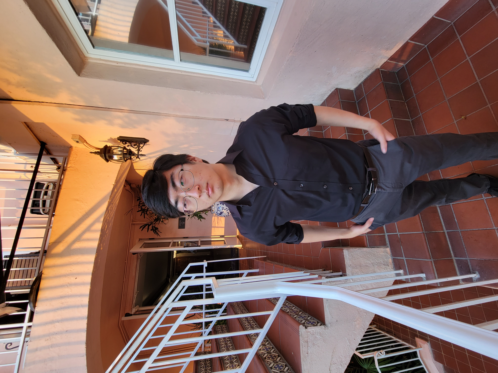

# Kevin Kang
Hey there, I'm Kevin! I'm a third year **computer engineering** student at 
[UC San Diego](https://ucsd.edu/). My interests are in computer graphics,
computer vision, and a lot more. At the moment, I'm working under the
supervision of Professors 
[Ravi Ramamoorthi](https://cseweb.ucsd.edu/~ravir/) and 
[Tzu-mao Li](https://cseweb.ucsd.edu/~tzli/) on helping solve *inverse
rendering* problems by building a pipeline to reconstruct the unknown geometry,
camera positions, materials, etc. of an input scene. 

#### contact, github, resume
- ktkang at ucsd.edu
- github.com/thekangster
- [resume](assets/kevinkangResume2023.pdf)

#### i like this quote
> People's feelings are memories that transcend time.

#### i dont like seg faults
```
int main() {
    void (*f)(void);
    f();
}
```

#### goals for cse 110 
- [ ] learn how to engineer software
- [ ] learn how to be a good teammate
- [ ] take over the world with our project

#### this quarter im taking
1. cse 110 - software engineering
2. cse 101 - algorithms
3. ece 101 - linear systems
4. wcwp 100 - warren writing
5. cse 198 - research


[this is a link to the README](README.md)

